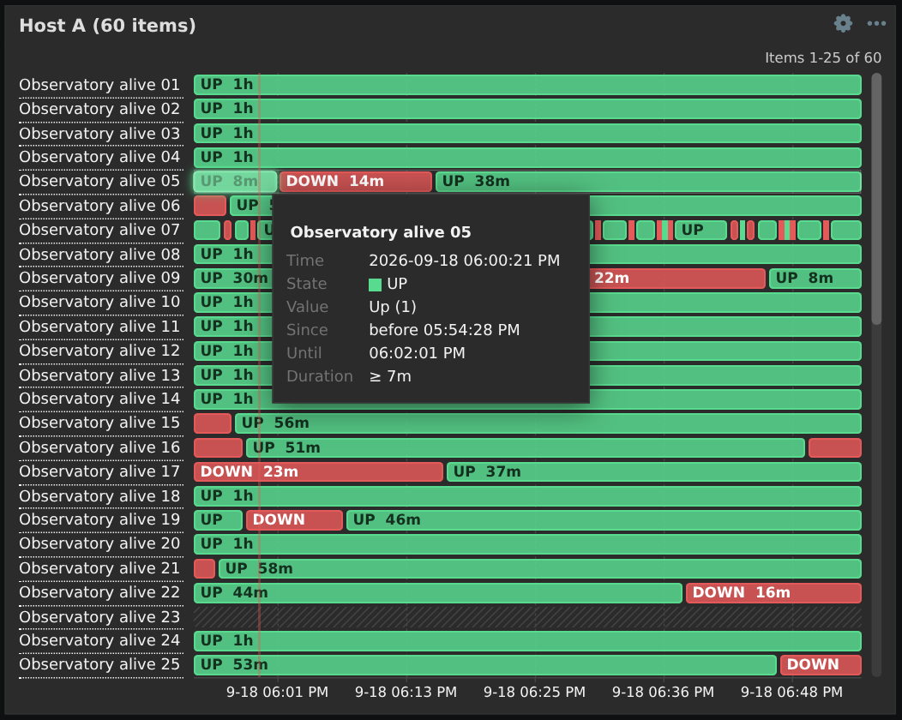
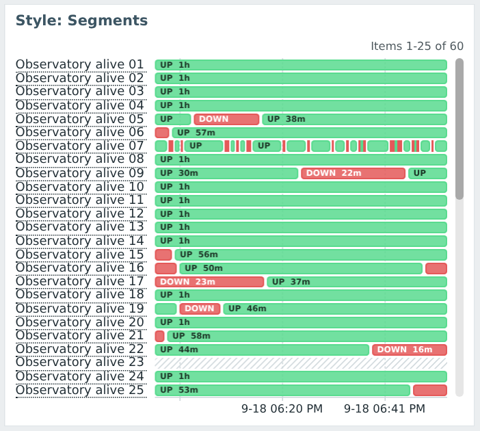
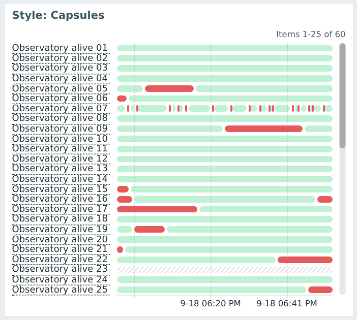
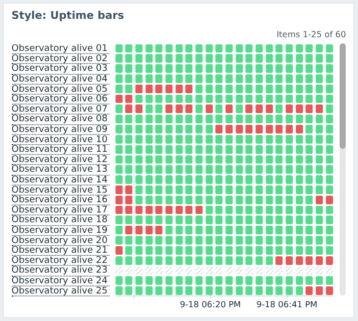
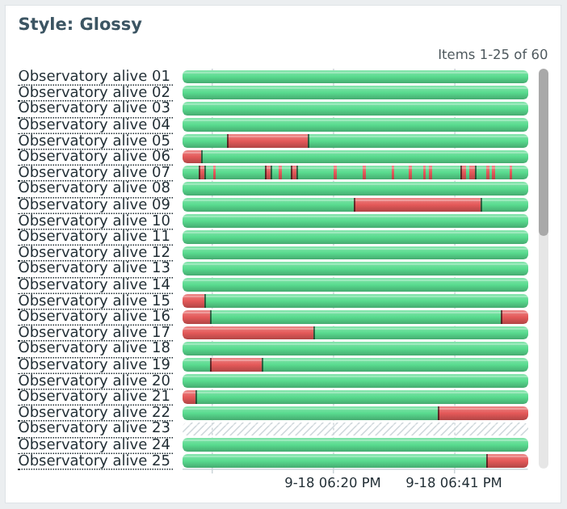
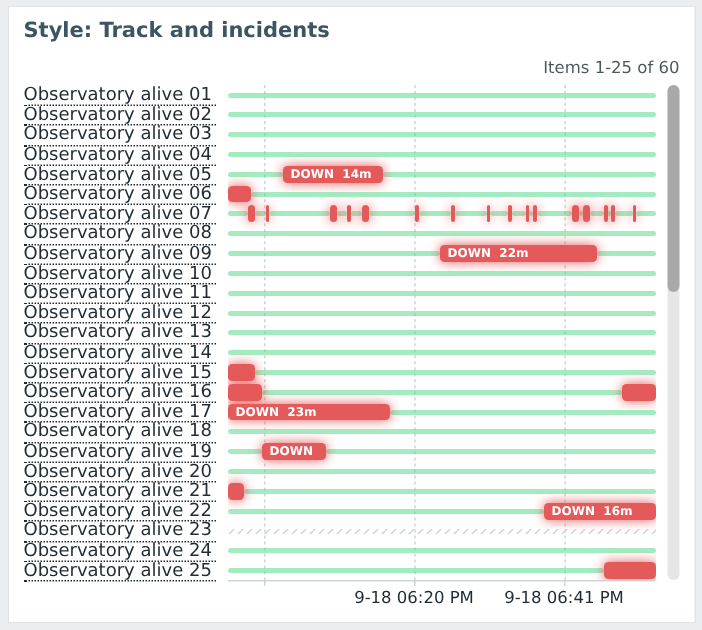
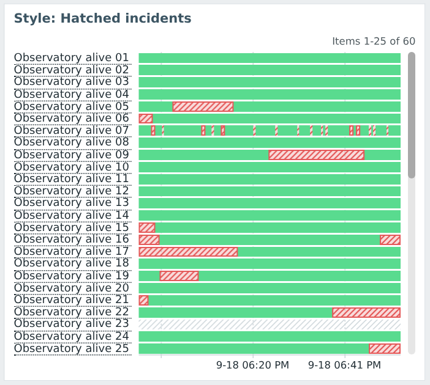

# State timeline widget for Zabbix 7.0

## Description

**State timeline** is a dashboard widget module for Zabbix 7.0 LTS. It displays the history of boolean items
(`0/1`, `false/true`) as horizontal state timelines, one row per item:



It shows when each item was in state 0 or state 1, the exact moments of state changes and the duration of each
state, for up to 100 items at once.

## Features

- **Items by patterns**: item name and/or key patterns with `*` wildcards (for example,
  `xray.observatory.alive[*]` or `xray.*`), host groups, hosts, host tags and item tags, same as in the
  Honeycomb widget. Numeric items only (unsigned and float).
- **Up to 100 items**. If more items match, the first 100 are displayed and the widget says so
  ("116 items match the patterns, the first 100 are displayed."). Items are sorted in a stable order:
  by host and item name (default), by item name or by item key.
- **25 items at once**, more items are reachable with a vertical scrollbar at the right of the timelines: drag
  the scrollbar, use the mouse wheel over the widget (at the first or last item the dashboard scrolls as usual) or
  the keyboard on the focused scrollbar (arrows, Page Up/Down, Home/End). Scrolling is animated and does not reload
  data. The position is kept on resize and refresh. The range of displayed items ("Items 26-50 of 60") is shown
  above the timelines.
- **Seven styles** of state bars, see [Styles](#styles).
- **Step function**, no interpolation: a value is valid until the next value. `12:00 = 1, 12:01 = 1,
  12:02 = 1, 12:37 = 0` is one state change at 12:37. State changes are bound to the exact timestamps of history
  values (including nanoseconds), state change markers make them visible.
- **State from before the period**: the last value before the period start is used, so rarely collected items
  (or items with "Discard unchanged" preprocessing) show their state from the period start.
- **Hovered state interval is outlined**, the same interval as "Since" - "Until" in the tooltip.
- **Tooltip of the hovered item only**: item name, time, state, value (with value mapping and units), start of the
  state, end of the state and the state duration.
- **Time period of the Graph widget**: dashboard time period or a widget specific period, zoom by selecting a time
  range with the mouse, zoom out by double click, same X axis (grid, labels and time formats) as the Graph widget.
- **Colors and labels** of both states are configurable, as well as the "no data" color.
- Optional **threshold** (state 1 is `value >= threshold` instead of `value != 0`) and
  **"No data after"** period (values older than the period are shown as missing data).
- **Item context menu** (Latest data, Graph, Values, Configuration, ...) by clicking the item name, full name
  and key in the tooltip of long names.
- Works in the blue, dark and high-contrast themes, at any widget size (item names are hidden in very low rows,
  they are still shown in the tooltip).

## Styles

The style is selected in the widget configuration (*Style*). The same data in each style (blue theme):

| Segments (default) | Flat |
|---|---|
|  |  |
| Rounded segments with a gap at state changes, like Grafana State timeline. Optional state label and duration inside segments ("UP 22m"). | Solid blocks with state change markers. |

| Capsules | Uptime bars |
|---|---|
|  |  |
| Pill shaped segments: state 1 is muted, state 0 stands out. | Status page like ticks: each tick shows the worst state within it. |

| Glossy | Track and incidents |
|---|---|
|  |  |
| Vertical gradient with a highlight, rounded row ends. | State 1 is a thin track, state 0 is a full height glowing block. Optional labels of incidents ("DOWN 12m"). |

| Hatched incidents | |
|---|---|
|  | |
| State 0 is hatched with the state 0 color, like missing data: distinguishable without colors. | |

The hovered state interval is highlighted with a glow of the state color, in the shape of segments of the style.

## Requirements

- Zabbix frontend **7.0.0 – 7.0.x** (Zabbix 7.0 LTS).
- PHP version supported by the Zabbix frontend.
- A browser supported by Zabbix 7.0.

## Installation

1. Copy the module to the `modules` directory of the Zabbix frontend, for example:

   ```bash
   git clone <repository URL> /usr/share/zabbix/modules/statetimeline
   ```

2. In the Zabbix frontend go to *Administration → General → Modules*, click *Scan directory* and enable
   **State timeline**.
3. Add the **State timeline** widget to a dashboard.

## Configuration

| Parameter              | Description                                                                          |
|------------------------|--------------------------------------------------------------------------------------|
| Host groups, Hosts     | Hosts to search items on. Empty: all hosts.                                          |
| Host tags              | Host tag filter.                                                                     |
| Item patterns          | Item name and/or key patterns, `*` matches any characters. `*` alone: all items.     |
| Match patterns by      | *Name or key* (default), *Name*, *Key*.                                              |
| Item tags              | Item tag filter.                                                                     |
| Sort by                | *Host, item name* (default), *Item name*, *Item key*.                                |
| Time period            | *Dashboard* (default), another widget or a custom period, as in the Graph widget.    |
| Style                  | Style of state bars, see above. *Segments* by default.                               |
| Show state labels      | State label and duration inside segments: all segments (*Segments*), incidents only (*Track and incidents*). |
| Show tooltip           | Tooltip of the hovered item.                                                         |
| Show state duration    | End and duration of the state in the tooltip.                                        |
| State 1 / State 0      | Label (`UP` / `DOWN` by default) and color of the state.                             |
| No data color          | Color of periods without data. Empty: hatched with the grid color of the theme.      |
| State 1 threshold      | Values `>=` threshold are state 1. Empty (default): 0 is state 0, other values are 1. |
| No data after          | For example `5m`: a value is valid for at most 5 minutes. Empty (default): until the next value. |

The refresh interval is the standard widget refresh interval.

Limits are set in `manifest.json` (`config`):

| Option             | Default | Description                                                                     |
|--------------------|---------|---------------------------------------------------------------------------------|
| `max_items`        | 100     | Maximum number of displayed items.                                              |
| `items_per_page`   | 25      | Number of items displayed at once.                                              |
| `raw_values_limit` | 200000  | Maximum number of history values loaded per widget update (see below).          |

## How it works

The widget is built from the same parts as the built-in Graph and Honeycomb widgets:

| Part                         | Reused from                                                                       |
|------------------------------|-----------------------------------------------------------------------------------|
| Widget lifecycle, refresh    | `CWidget` (dashboard framework), same update cycle as the Graph widget.           |
| Time period, zoom, zoom out  | Graph widget: `time_period` field, `_timeperiod` broadcasting and feedback, `timeselector.calc` (`rangeoffset`, `zoomout`), selection box styles. |
| Item selection               | Honeycomb widget: pattern select field, host/item tag filters, `item.get` with wildcards. |
| History                      | `API history.get` (batched) and `Manager::History()` (`getAggregatedValues`, `getGraphAggregationByWidth`), SQL and Elasticsearch storages. |
| History or trends            | Same rule as in the Graph widget (history/trends storage periods, housekeeping overrides, `ZBX_MAX_TREND_DIFF`). |
| X axis                       | Same grid algorithm and time formats as the Graph widget (`CSvgGraph::getTimeGridWithPosition`), graph theme colors. |
| Tooltip                      | `hintBox` and styles of the Graph widget tooltip.                                  |
| Item names                   | Standard item context menu (`menu.popup`), value maps and units (`formatHistoryValue`). |

The Graph widget itself is not forked: its tooltip shows all series at once and it draws on the server, so rows,
tooltip and navigation are implemented by the widget.

### Data loading

One widget update is one request to the server, for all items. The server converts history to *runs* (time
intervals with the same value), so both the processing and the response size depend on the number of state
changes, not on the number of collected values:

1. **Changes only** (MySQL and PostgreSQL, SQL history storage): one query per value type returns only the values
   differing from the previous value of the item (window function `LAG`). A boolean item collected every 30
   seconds gives a couple of rows per day instead of 2880. State changes are exact.
2. **All values** (Elasticsearch or other databases): the number of values is counted, and values of items fitting
   `raw_values_limit` are loaded with `history.get` in batches. State changes are exact.
3. **Aggregated mode**: items not loaded above, items with more state changes than 4 per pixel, and long periods
   (more than 225 seconds per pixel, same rule as in the Graph widget) are loaded with
   `getGraphAggregationByWidth()` (min/max per pixel) from history or trends. A pixel containing both states is
   drawn half state 1 (upper half) and half state 0 (lower half), times in the tooltip are approximate ("≈"),
   zoom in to get exact times.
4. The last value before the period start is loaded for the items that need it: items having a value within the
   first pixel of the timeline are skipped, as this lookback query (within the "Max history display period"
   setting) is the most expensive one on large history tables.

The browser keeps the data of all items and draws only visible rows on a single canvas, so scrolling, resizing
and hovering do not load data. The number of DOM elements does not depend on the number of values. Moving the
mouse does not redraw the rows (the helper line, highlight and selection are drawn on an overlay).

Response time of one update, PostgreSQL, items with a value every 30 seconds ("all values" is the fallback used
for Elasticsearch and other databases):

| Items | Period | Values in period | Changes only | All values |
|-------|--------|------------------|--------------|------------|
| 20    | 1 hour | 2 400            | 0.06 s       | 0.11 s     |
| 20    | 6 hours| 14 400           | 0.08 s       | 0.19 s     |
| 20    | 2 days | 115 000          | 0.17 s       | 0.45 s     |
| 100   | 1 day  | 288 000          | 0.07 s       | 0.96 s     |
| 100   | 3 days | 864 000          | 0.17 s       | 1.8 s      |

## Development

`dev/docker-compose.yml` starts Zabbix 7.0 (latest patch release on port 8090 and 7.0.0 on port 8091) with the
module mounted. `dev/seed.py` creates test hosts, items, history and a dashboard with several widgets (and a "Styles" page with a
widget of each style):

```bash
docker compose -f dev/docker-compose.yml up -d
python3 dev/seed.py
```

User: `Admin`, password: `zabbix`.

Tests of the conversion of history to runs:

```bash
docker run --rm -v "$PWD":/m -w /m php:8.3-cli-alpine php tests/CStateTimelineTest.php
```

## License

GNU Affero General Public License v3.0, see [LICENSE](LICENSE).
